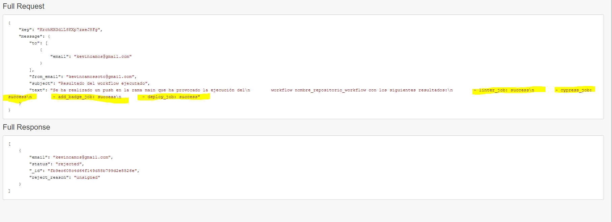
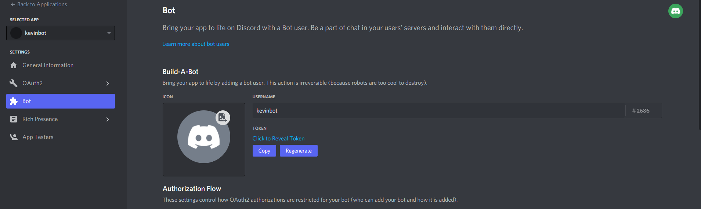
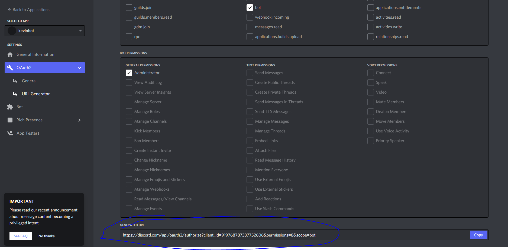
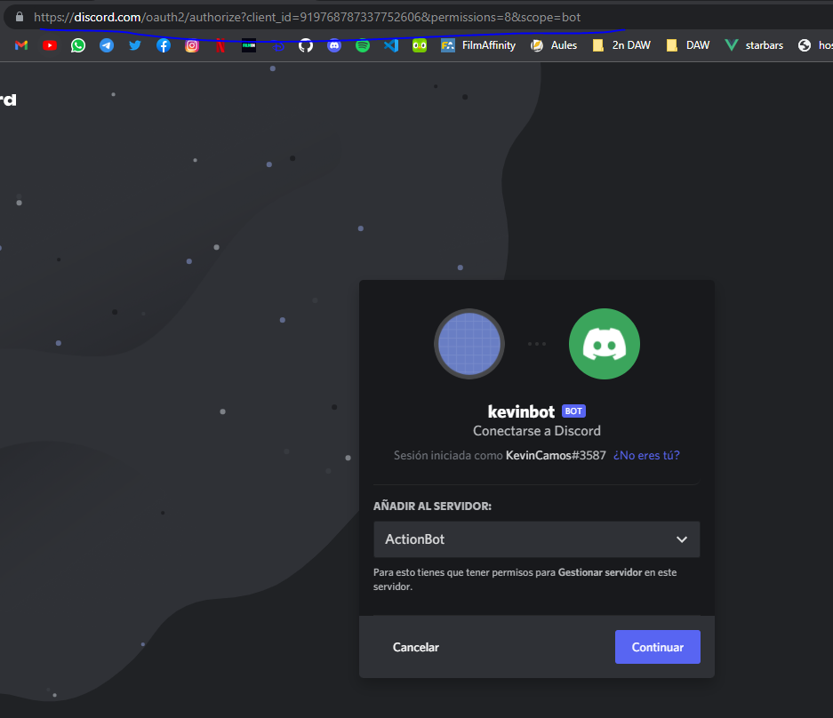
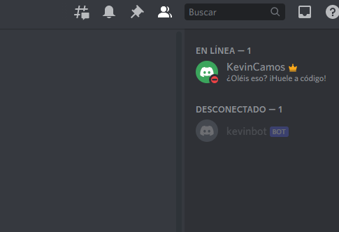

# PRÁCTICA ACTIONS

Por  [`Kevin Camos Soto`](https://github.com/KevinCamos)

## Table of Contents

1. [Linter job](#Linter_job)
2. [Cypress job](#Cypress_job)
3. [Add_badge job](#Add_badge_job)
4. [Deploy job](#Deploy_job)
5. [Notification job](#Notification_job)
6. [Discord job](#Discord_job)


# Linter Job 💻

`Job en WORKFLOW de Linter Job`

```yml
  Linter_job:
    runs-on: ubuntu-latest
    steps:
    - name: checkout_codigo
      uses: actions/checkout@v2
    - name: Install dependencies
      run: |
        npm install

    - name: Lint files
      run: |
        npm run lint
```
`Steps`

1. **Checkout_codigo:**
  Este step es recurrente en la aplicación y esta será la única vez que lo definamos. Sirve para obtener el código del repositorio y poder hacer los test necesarios sobre este o utilizarlo como creamos.

2. **Install dependencies:**
  Instala las dependencias de node modules del package.json, necesario para poder ejecutar el próximo step

3. **Lint files:**
  Ejecuta linter con el comando "npm run lint", el cual verifica que no haya errores en el código como comillas simples en lugar de dobles o Switch-case mal ordenados

`Anotaciones del autor`

  En el ejercicio, este job encuentra una serie de errores en pages/api/users, como un Switch donde el default está puesto antes que el último case, comillas simples en lugar de dobles o el "POST0", el cual no se si debía de dar error aquí o más tarde ya que lo quité de antemano para ahorrarme en salud.

---

# Cypress Job 💻

`Job en WORKFLOW de Cypress Job`

```yml
Cypress_job:
    runs-on: ubuntu-latest
    needs: Linter_job
    steps:
    - name: checkout_codigo
      uses: actions/checkout@v2
    - name: Cypress run
      uses: cypress-io/github-action@v2
      with:
        config-file: cypress.json
        start: npm start
        build: npm run build
      id: cypress
      continue-on-error: true
    - name: "Result"
      run: |
        echo ${{ steps.cypress.outcome }}  > result.txt
    - name: "Upload Artifact"
      uses: actions/upload-artifact@v2
      with:
        name: result.txt
        path: result.txt
```
`Needs`

Lo ejecutamos tras el anterior proceso siempre y cuando éste último haya finalizado con éxito.

`Steps`
1. **Cypress run:**
  Esta actión está creado por otros usuarios, por lo que lo importamos y a partir de su documentación definimos el archivo de configuración, lo iniciamos y contruimos.  Seguidamente nos encontramos con "continue-on-error:true" que nos permite continuar el job incluso si se encuentra algún error. 

2. **Result :**
  Nos imprime la salida del action anterior en el archivo result.txt

3. **Upload Artifact:**
  Creará un artifact usando la acción ajena  con el nombre "result.txt" y la ruta homónima


---
# Badge Job 💻

`Job en WORKFLOW de Badge Job`

```yml

 Add_badge_job:
    runs-on: ubuntu-latest
    if: ${{always()}}
    needs: Cypress_job
    steps:
    - name: checkout_codigo
      uses: actions/checkout@v2
    - name: Download a single artifact
      uses: actions/download-artifact@v2
      with:
        name: result.txt
    - name: output-artifact
      run: echo "::set-output name=cypress_outcome::$(cat result.txt)"
    - name: Action Update Readme
      uses: ./.github/actions/badge/
      with:
        resultado_test: ${{ steps.cypress.outputs.cypress_outcome }}
    - name: Push cambios Readme
      run: |
        git config user.name KevinCamos
        git config user.email kevincamossoto@gmail.com
        git add .
        git commit --allow-empty -m "update readme"
        git push 
```

`If`

Usamos "    if: ${{always()}}" para ordenar al action que indistíntamente de si las actions de las que depende (usando "needs") finalizan con nulo éxito, que realice la acción.
 ```yml 
     if: ${{always()}}
 ```

`Needs`

Lo ejecutamos tras el proceso "Cypress_job" y indistíntamente de si  éste ha finalizado con éxito.

`Steps`
1. **Download a single artifact:** Este step continua el anterior job de Cypress, en el que creábamos un artifact y hacíamos upload. Esta vez realizamos un download para descargar el artifact que habíamos definido como "result.txt"

2. **output-artifact :** Imprime el artifact del step anterior en nuestro archivo de nombre homónimo 
3. **Action Update Readme:** En este punto ejecutaremos nuestra action que vamos a definir posteriormente, el cual nos permitirá editar este archivo README.md, y almacenar en un punto determinado el resultado que habíamos almacenado anteriormente en Artifact y nos hemos descargado.

`Action`

 ```yml 
name: 'badge'
description: 'Resultado Test'
inputs:
    resultado_test: 
      description: 'Resultado del test'
      required: true
outputs:
  respuesta:
    description: 'README Modificado!'
runs:
  using: 'node12'
  main: 'index.js'
   ```
`Inputs`
1. **Inputs:** Definimos que va a tener un único input obligatorio y requerido con el nombre "resultado_test"

2. **Outputs :** Definimos las outputs que consideremos pertinentes

`Javascript del action`


```js
const core = require('@actions/core')
const fs = require("fs");

const resultado_test = core.getInput('resultado_test')

var succes= "https://img.shields.io/badge/tested%20with-Cypress-04C38E.svg"
var fail =  "https://img.shields.io/badge/test-failure-red";
console.log(resultado_test)

try {
    const readme = "./README.md";
    var content = resultado_test != "failure" ? succes:fail;
    content =`RESULTADOS DE LOS ÚLTIMOS TEST: `
    fs.readFile(readme, 'utf8', function (err, data) {
        data = data.split("<!-- RESULTADO -->")

        data = data[0]+ "\n<!-- RESULTADO -->\n"+content+"\n<!-- RESULTADO -->\n"+ data[2]; 
        fs.writeFile(readme, content, function (err, result) {
            if (err) console.log('error', err);
        });
    });
    core.setOutput = ("frase-de-prueba resultado_test", resultado_test)

} catch (error) {
    var content =  "failure";
    fs.readFile(readme, 'utf8', function (err, data) {
        data = data.split("<!-- RESULTADO -->")
        data = data[0]+ "\n<!-- RESULTADO -->\n"+content+"\n<!-- RESULTADO -->\n"+ data[2];
        fs.writeFile(readme, data, function (err, result) {
            if (err) console.log('error', err);
        });
    });

    core.setFailed(error.message)
}
```


---
### RESULTADOS DE LOS ÚLTIMOS TEST: 


<!-- RESULTADO -->

<!-- RESULTADO -->
---

`Anotaciones del autor`

Aunque hemos definido outputs en todas las actions, no nos han sido necesario utilizarlos.


---
# Deploy Job 💻

`Job en WORKFLOW de Deploy Job`

```yml
 Deploy_job:
    runs-on: ubuntu-latest
    needs: Cypress_job
    steps:
    - name: checkout_codigo
      uses: actions/checkout@v2
    - name: vercel-action
      uses: amondnet/vercel-action@v20
      with:
        vercel-token: ${{ secrets.VERCEL_TOKEN }} # Required
        github-token: ${{ secrets.GITHUB_TOKEN }} #Optional 
        # vercel-args: '--prod' #Optional
        vercel-org-id: ${{ secrets.ORG_ID}}  #Required
        vercel-project-id: ${{ secrets.PROJECT_ID}} #Required 
        working-directory: ./
# https://vercel.com/kevincamos/workflowactionsdaw/HeBe4wxE8FG23zW64GZbcrDF3KhX
# https://workflowactionsdaw-9931pzwjv-kevincamos.vercel.app/
```
`Needs`

Lo ejecutamos tras el proceso "Cypress_job" y cuando éste haya finalizado con éxito.

`Steps`
1. **vercel-action:** Esta és una action externa que importamos, por lo que hay que seguir su documentación, en la que tenemos que definir una serie de variables.


`Anotaciones del autor`

GITHUB_TOKEN es la única que no debemos crear, las otras las conseguimos al registrarnos y linkearnos en vercel, esta nos ofrece un archivo con las ID que nos ha proporcionado, aparte tenemos que 


El Token de vercel se consigue desde la aplicación web en la que nos hemos logeado.


`RESULTADO`

##### https://vercel.com/kevincamos/workflowactionsdaw/HeBe4wxE8FG23zW64GZbcrDF3KhX
##### https://workflowactionsdaw-9931pzwjv-kevincamos.vercel.app/
---
# Notification Job 💻

`Job en WORKFLOW de Notification Job`

```yml
  Notification_job:
    runs-on: ubuntu-latest
    if: ${{always()}}
    needs: [Linter_job, Cypress_job, Add_badge_job, Deploy_job]
    steps:
      - name: checkout_codigo
        uses: actions/checkout@v2
      - name: Action Email
        uses: ./.github/actions/email/
        # id: hello 
        with:
          linter_job: ${{ needs.Linter_job.result }}
          cypress_job: ${{ needs.Cypress_job.result }}
          add_badge_job: ${{ needs.Add_badge_job.result }}
          deploy_job: ${{ needs.Deploy_job.result }}
          send_from: ${{ secrets.MY_EMAIL}}
          send_to: ${{ secrets.EMAIL_TO}}
          apy_key: ${{ secrets.KEY_MAILCHIMP}}
```
`If`

Usamos "if: ${{always()}}" para ordenar al action que indistíntamente de si las actions de las que depende (usando "needs") finalizan con nulo éxito, que realice la acción.
 ```yml 
     if: ${{always()}}
 ```
`Needs`

Definimos una array de todos los procesos sobre los que queremos que dependa y que hayan finalizado antes de empezar

`Steps`
1. **Action Update Readme:** En este punto ejecutaremos nuestra action que vamos a definir posteriormente, el cual nos permitirá enviarle 7 variables de enterno, 4 de los que son los resultados de los jobs que dependíamos y 3 secrets entre los que se encuentra la KEY de la aplicación de mensajería.

`Action`

 ```yml 
name: 'email'
description: 'Resultado Test'
inputs:
    linter_job: 
      description: 'Resultado de linter_job'
      required: true
    cypress_job: 
      description: 'Resultado de cypress_job'
      required: true
    add_badge_job: 
      description: 'Resultado de add_badge_job'
      required: true
    deploy_job: 
      description: 'Resultado de deploy_job'
      required: true
    send_from: 
      description: 'Emisor del correo'
      required: true
    send_to: 
      description: 'Receptor del correo'
      required: true
    apy_key: 
      description: 'API_KEY de MialChimp Mandrill'
      required: true
outputs:
  respuesta:
    description: 'README Modificado!'
runs:
  using: 'node12'
  main: 'index.js'


   ```
`Inputs`
1. **Inputs:** Definimos los 7 inputs que vamos a introducir en el job

2. **Outputs :** Definimos las outputs que consideremos pertinentes

`Javascript del action`


```js
const core = require('@actions/core')
// const github = require('@actions/github')
/* const TelegramBot = require('node-telegram-bot-api');
 */
const apy_key = core.getInput('apy_key')

const mandrill = require('node-mandrill')(apy_key); 


const linter_job = core.getInput('linter_job')
const cypress_job = core.getInput('cypress_job')
const add_badge_job = core.getInput('add_badge_job')
const deploy_job = core.getInput('deploy_job')
const send_from = core.getInput('send_from')
// const send_to = core.getInput('send_from')
const send_to = core.getInput('send_to')

//send an e-mail to jim rubenstein
mandrill('/messages/send', {
    message: {
        to: [{email: send_to}],
        from_email: send_from,
        subject: "Resultado del workflow ejecutado",
        text: `Se ha realizado un push en la rama main que ha provocado la ejecución del
        workflow nombre_repositorio_workflow con los siguientes resultados:
        - linter_job: ${linter_job}
        - cypress_job: ${cypress_job}
        - add_badge_job: ${add_badge_job}
        - deploy_job: ${deploy_job}`
    }
}, function(error, response)
{
    //uh oh, there was an error
    if (error) console.log( JSON.stringify(error) );

    //everything's good, lets see what mandrill said
    else console.log(response);
});

```


`Anotaciones del autor`

La actión funciona perfectamente y sin problemas. Aunque al usar una aplicación externa de mensajería y solicitarme entre otros datos, la dirección web o la DNS, los correos llegan hasta el buzón de esta aplicaición, pero no llegan a recibirse. 

Adjunto resultado del e-mail a medio enviar.





---
#  Discord Job 💻

`La Custom Job personalizada en WORKFLOW de Discord Job`

```yml
    Discord_job:
    runs-on: ubuntu-latest
    steps:
      - name: checkout_codigo
        uses: actions/checkout@v2
      - name: Expose git commit data
        uses: rlespinasse/git-commit-data-action@v1.x
      - name: Send message discord
        uses: ./.github/actions/discord/
        with:
          discord_token: ${{ secrets.DISCORD_TOKEN }}
          id_channel: ${{ secrets.CHANNEL_ID }}
          commit_author: ${{ env.GIT_COMMIT_AUTHOR }}
          commit_committer: ${{ env.GIT_COMMIT_COMMITTER }}
          commit_message: ${{ env.GIT_COMMIT_MESSAGE_SUBJECT }}
```


`Steps`
1. **Expose git commit data:** Está acción externa nos permite obtener las variables de nuestros commits, como el author, el realizador del commit o el mensaje de este.

2. **Send message discord:** En este punto ejecutaremos nuestra action que vamos a definir posteriormente, el cual nos permitirá enviarle 5 variables de enterno, 3 que serán las variables del commit que nos proporciona el anterior step y 2 que serán el Token del bot de Discord, y otro el ID del canal al que enviaremos el mensaje.

`Action`

 ```yml 
name: 'discord'
description: 'Discord Bot'
inputs:
    discord_token: 
      description: 'discord_token'
      required: true
    id_channel: 
      description: 'id_channel'
      required: true
    commit_author: 
      description: 'commit_author'
      required: false
    commit_committer: 
      description: 'commit_committer'
      required: false
    commit_message: 
      description: 'commit_message'
      required: false
outputs:
  respuesta:
    description: 'Mensaje enviado al canal de discord!'
runs:
  using: 'node12'
  main: 'index.js'
   ```
`Inputs`
1. **Inputs:** Definimos los 5 inputs que vamos a introducir en el job

2. **Outputs :** Definimos las outputs que consideremos pertinentes

`Javascript del action`


```js
const core = require('@actions/core')
const discord_token = core.getInput('discord_token')
const id_channel = core.getInput('id_channel')
const commit_author = core.getInput('commit_author')
const commit_committer = core.getInput('commit_committer')
const commit_message = core.getInput('commit_message')


const { Client, Intents } = require("discord.js");
const client = new Client({
  intents: [Intents.FLAGS.GUILDS, Intents.FLAGS.GUILD_MESSAGES],
});
client.on("ready", () => {
  console.log(`Logged in as ${client.user}!`);

  client.channels
    .fetch(id_channel)
    .then((channel) => channel.send(`
    COMMIT AUTHOR:    ${commit_author}
    COMMIT COMMITTER:     ${commit_committer}
    COMMIT MESSAGE:       ${commit_message}
    
    `))
    .catch((err) => console.log("Could not find the channel."));
});


client.login(discord_token);

```


`Anotaciones del autor`

Para realizar esta action, la cual en principio no funciona por problemas de compilación por parte del "ncc build index.js"  y totalmente ajeno al creador de este fantástico action, adjunto pasos para crear el bot.


1. Vamos a https://discord.com/developers/applications/ para crear el bot, el cual nos da un token




2. Definimos el bot como administrador y obtenemos un enlace para poder importar el bot a tu sala de discord



3. Importamos el bot en la sala que deseamos




4. Comprobamos que se encuentra en nuestra sala



