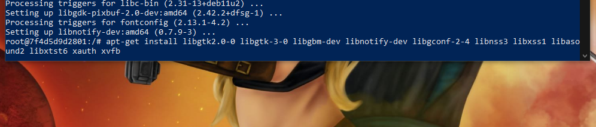

# PRÁCTICA ACTIONS

Por [`Kevin Camos Soto`](https://github.com/KevinCamos)

## Table of Contents

1. [Trigger](#Trigger)
2. [Parameters](#Parameters)
3. [Environments](#Environments)
4. [Linter Stage](#Linter_Stage)
5. [Cypress Stage](#Cypress_Stage)
6. [Add_badge Stage](#Add_badge_Stage)
7. [Deploy Stage](#Deploy_Stage)
8. [Notification Stage](#Notification_Stage)
9. [Discord Stage](#Discord_Stage)

# Trigger 💻

`Trigger cada 3 horas`

```
  triggers {
            pollSCM('H */3 * * *')
     } 
```


1. **Trigger:** Cada 3 horas comprueba si hay algún cambio en el repositorio, si lo hay, vuelve a ejecutarse

# Parameters 💻

`Parametros para la aplicación`

```
          parameters {
            string(name: 'EJECUTOR', defaultValue: 'Kevin', description: 'Ejecutor: de tipo texto en el que se especificará el nombre de la persona que ejecuta la pipeline')
            string(name: 'MOTIVO', defaultValue: 'DAW', description: 'Motivo: de tipo texto también en que podremos especificar el motivo por el cual estamos ejecutando la pipeline.')
            string(name: 'MAIL', defaultValue: 'ejemplo@gmail.com', description: 'Correo notificación: de tipo texto que almacenará el correo al que notificaremos el resultado de cada stage ejecutado')
            booleanParam(name: 'COMMITPIPELINE', defaultValue: false, description: 'Esta variable es para determinar si quieres realizar un commit al ejecutar el pipeline y no entrar en un bucle de commits a causa del trigger') 

        }
```
1. **EJECUTOR:** Ejecutor: de tipo texto en el que se especificará el nombre de la persona que ejecuta la pipeline
2. **MOTIVO:** Motivo: de tipo texto también en que podremos especificar el motivo por el cual estamos ejecutando la pipeline.
3. **MAIL:** Correo notificación: de tipo texto que almacenará el correo al que notificaremos el resultado de cada stage ejecutado
4. **COMMITPIPELINE:** Esta variable es para determinar si quieres realizar un commit al ejecutar el pipeline y no entrar en un bucle de commits a causa del trigger

# Environments 💻


`Iniciamos las variables para obtener los resultados y para evitar problemas con cypress`

```
      environment {
            RESULT_LINTER = "false"
            RESULT_CYPRESS = "false"
            RESULT_BADGE = "false"
            RESULT_VERCEL = "false"
            TERM = 'xterm'
            NO_COLOR = '1'


        }   
```

1. **Obtener Valores:** Iniciamos las 4 primeras variables para obtener el valor del resultado de los scripts
2. **TERM Y NO_COLOR:** Estas variables son iniciadas para evitar error con cypress.
`Anotaciones del autor`
 
- Estas dos últimas fueron idea del compañero de clase Juanjo, el qual me ayudó con errores que no debían de ocurrir en la ejecución.

# Linter Stage 💻

`Stage en PIPELINE de Linter `

```
          stage('Linter_Stage') {
            steps {
                script{
                    RESULT_LINTER = sh (script:"npm run lint", returnStatus: true)
                }
            }
        }
```

`Steps`

1. **Script:** Dentro de script realizamos "npm run lint" para ejecutar linter, y obtenemos el resultado de la operación con "returnStatus" y los almacenamos para la posteridad

# Cypress Stage 💻

`STAGE en PIPELINE de Cypress Stage`

```
 stage('Cypress_stage') {
            steps {
                script{
                    sh "npm run build"
                    sh "npm run start &"
                    RESULT_CYPRESS = sh (script:"cypress run --headed", returnStatus: true)
                }
        }
```

`Steps`

1. **Script:** Dentro de script realizamos "npm run build" y "npm run start &", este último comando que tiene "&" se realiza para poder seguir ejecutando comandos en la consola teniendo el proyecto iniciado. Tras esto ejecutamos "cypress run --headed"

`Anotaciones del autor`
 
- En este ejercicio hubo bastante ayuda entre toda la clase como comunidad, facilitandonos la cantidad de problemas que nos dio.

- Para ejecutar Cypress hay que instalar desde el script una serie de dependencias, las cuales he optado por instalar desde dentro del contenedor.


---

# Badge Stage 💻

`STAGE en PIPELINE de Badge Stage`

```
        stage('Git_commit') {
            steps {
                    script{
                if ("${params.COMMITPIPELINE}" == true) {
                        sh "node ./jenkinscripts/badge.js $RESULT_CYPRESS"
                        sh "git config user.name KevinCamos"
                        sh "git config user.email kevincamossoto@gmail.com"
                        sh "git add README.md"
                        sh "git commit --allow-empty -m 'Pipeline ejecutada por ${params.EJECUTOR}. Motivo: ${params.MOTIVO}' "
                        withCredentials([usernameColonPassword(credentialsId: 'dd4df5a6-38ac-4fb6-89e8-fa9da0d7ac5e', variable: 'USERPASS')]) {
                            sh "git remote set-url origin https://$USERPASS@github.com/KevinCamos/practica_workflow"
                        }

                        RESULT_BADGE = sh (script: "git push origin HEAD:jenkins" , returnStatus: true)
                    } else {
                        echo 'Esta ejecución debe haberla realizado un trigger'
                    }

                }
            }

        }
```

`Steps`

1. **Conditional:** Ejecutamos un "if" para comprobar que la variable "COMMITPIPELINE" no está por defecto, así podemos evitar un bucle de commits a raiz del trigger

2. **Comandos :** Al igual que la práctica anterior modificamos el README, pero en lugar de usar un action, facilitamos los valores por el comando de ejecución.
3. **Más comandos:** A diferencia de la anterior práctica, aquí no estamos en github, por lo que necesitamos facilitar nuestras credenciales con "withCredentials", de tipo usernameColon Password, la cual hemos dado de alta desde Jenkins y posteriormente con "git remote set-url origin" poner nuestras credenciales junto a la ruta del proyecto.

`Javascript del action`

```js
const fs = require("fs");

const resultado_test = process.argv[2];

var succes = "https://img.shields.io/badge/tested%20with-Cypress-04C38E.svg";
var fail = "https://img.shields.io/badge/test-failure-red";
console.log(resultado_test);

const readme = "./README.md";
var content = resultado_test != "failure" ? succes : fail;

content = `RESULTADOS DE LOS ÚLTIMOS TEST: `;
try {
  fs.readFile(readme, "utf8", function (err, data) {
    data = data.replace(`RESULTADOS DE LOS ÚLTIMOS TEST: `, content);
    data = data.replace(`RESULTADOS DE LOS ÚLTIMOS TEST: `, content);
    fs.writeFile(readme, data, function (err, result) {
      if (err) console.log("error", err);
    });
  });
} catch (error) {
  var content = `RESULTADOS DE LOS ÚLTIMOS TEST: `;
  fs.readFile(readme, "utf8", function (err, data) {
    data = data.replace(`RESULTADOS DE LOS ÚLTIMOS TEST: `, content);
    data = data.replace(`RESULTADOS DE LOS ÚLTIMOS TEST: `, content);
    fs.writeFile(readme, data, function (err, result) {
      if (err) console.log("error", err);
    });
  });
}
```

---

### RESULTADOS DE LOS ÚLTIMOS TEST:

<!-- RESULTADO -->


<!-- RESULTADO -->

---

# Vercel 💻

`STAGE en PIPELINE de Vercel`


```
stage('Vercel') { steps { script{ withCredentials([ string(credentialsId: 'VERCEL_TOKEN', variable: 'VERCEL_TOKEN'), string(credentialsId: 'ORG_ID', variable: 'ORG_ID'), string(credentialsId: 'PROJECT_ID ', variable: 'PROJECT_ID')

                    ]) {
                      RESULT_VERCEL = sh (script:"vercel -confirm --env KEY1=$ORG_ID --env KEY2=$PROJECT_ID --token $VERCEL_TOKEN", returnStatus: true)
                    }

                }
            }
        }

```

`Steps`


1. **Variables :** Facilitamos las credenciales de tipo texto necesarias y dadas de alta en la aplicación de jenkins.
2. **Script:**   Ejecutamos el comando pertinente facilitado enla documentación con sus credenciales necesarias.


---

# Notification Stage && Discord Message en Paralelo 💻

`STAGE en WORKFLOW de Notification Stage`

```
 stage('Parallel In Sequential') {
            parallel {
                  stage('Send_email') {
                    steps {
                        script{
                                withCredentials([
                                string(credentialsId: 'MY_MAIL', variable: 'MY_MAIL'),
                                string(credentialsId: 'KEY_MANDRIL', variable: 'KEY_MANDRIL')
                                ]) { //set SECRET with the credential content
                                    sh "node ./jenkinscripts/email.js $RESULT_LINTER $RESULT_CYPRESS $RESULT_BADGE $RESULT_VERCEL ${params.MAIL} $KEY_MANDRIL"
                            }

                        }
                    }
                }
                stage('Discord Message') {
                    steps {
                        script{
                                withCredentials([
                                string(credentialsId: 'TOKEN_DISCORD', variable: 'TOKEN_DISCORD'),
                                string(credentialsId: 'DISCROD_CHANNEL	', variable: 'DISCROD_CHANNEL')

                                ]) { //set SECRET with the credential content
                                sh "node ./jenkinscripts/discord $TOKEN_DISCORD $DISCROD_CHANNEL" //Faltaran les credencials de mail                                      }
                            }
                        }
                    }
                }
            }
        }
```


1. **Parallel :** Para ejecutar los dos stage en paralel debemos crear los stages necesarios dentro de parallel, el qual para no tener problemas de sintaxis debemos introducir dentro de otro stage.


    1. **Send Email:**   Facilitamos las credenciales necesarias dadas de alta en Jenkins y además también le pasamos por los params creados anteriormente para el mensaje, junto al email de quien lo va a recibir y el resultado de los anteriores Stages que hemos ido almacenando
```js
const sender_sending = process.argv[6];
const API_KEY = process.argv[7];

const mandrill = require('node-mandrill')(API_KEY); 

//send an e-mail
mandrill('/messages/send', {
    message: {
        to: [{email: sender_sending}],
        from_email: sender_sending,
        subject: "Resultado de la pipeline ejecutada",
        text: `Se ha realizado un push en la rama main que ha provocado la ejecución del
        workflow nombre_repositorio_workflow con los siguientes resultados:
        - Linter_stage: ${process.argv[2]}
        - Test_stage: ${process.argv[3]}
        - Update_readme_stage: ${process.argv[4]}
        - Deploy_to_Vercel_stage: ${process.argv[5]}`
    }
}, function(error, response)
{
    //uh oh, there was an error
    if (error) console.log( JSON.stringify(error) );

    //everything's good, lets see what mandrill said
    else console.log(response);
});
```


   2. **Discord Message:**   Facilitamos las credenciales necesarias dadas de alta en Jenkins del token de discord y nuestro canal que recibirá el mensaje.    
  
```js
const discord_token =  process.argv[2]
const id_channel =  process.argv[3]


const { Client, Intents } = require("discord.js");
const client = new Client({
  intents: [Intents.FLAGS.GUILDS, Intents.FLAGS.GUILD_MESSAGES],
});
client.on("ready", () => {
  console.log(`Logged in as ${client.user}!`);

  client.channels
    .fetch(id_channel)
    .then((channel) => channel.send(`
    Pipeline realizada con pleno éxito
    
    `))
    .catch((err) => console.log("Could not find the channel."));
});

client.login(discord_token);
setTimeout(function () {
  process.exit(0);
}, 20000);
```


